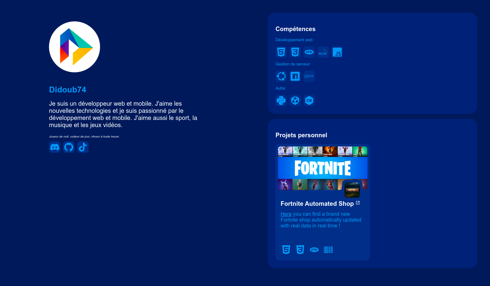

# Didoub74 Mini-CV

Bienvenue sur le dépôt GitHub de mon mini-CV! Ce dépôt contient le code source de mon site web personnel qui sert de mini-CV.

## Démonstration

Vous pouvez visualiser mon mini-CV en ligne en cliquant sur le lien suivant : [https://www.didoub74.fr](https://www.didoub74.fr)

## Aperçu

Ce site web contient une brève présentation de moi-même, mes compétences clés, mes projets personnels et mes coordonnées numériques.

## Captures d'écran



## Technologies Utilisées

- HTML
- CSS

## Installation et Visualisation

1. Clonez ce dépôt sur votre machine locale en utilisant la commande suivante :

    ```git clone https://github.com/Didoub74/didoub74-website.git```

2. Accédez au répertoire du projet :
    
    ```cd didoub74-website```

3. Ouvrez le fichier `index.html` dans votre navigateur web pour visualiser votre mini-CV.

## Personnalisation

Vous pouvez personnaliser ce mini-CV en modifiant les fichiers HTML et CSS selon vos préférences.

## Contribution

Les contributions sont les bienvenues! Si vous avez des suggestions d'amélioration ou des correctifs à apporter, n'hésitez pas à ouvrir une demande de pull.

## Contact

Si vous avez des questions ou des commentaires, vous pouvez me contacter sur Discord, Github ou TikTok.

Merci d'avoir visité mon mini-CV!
